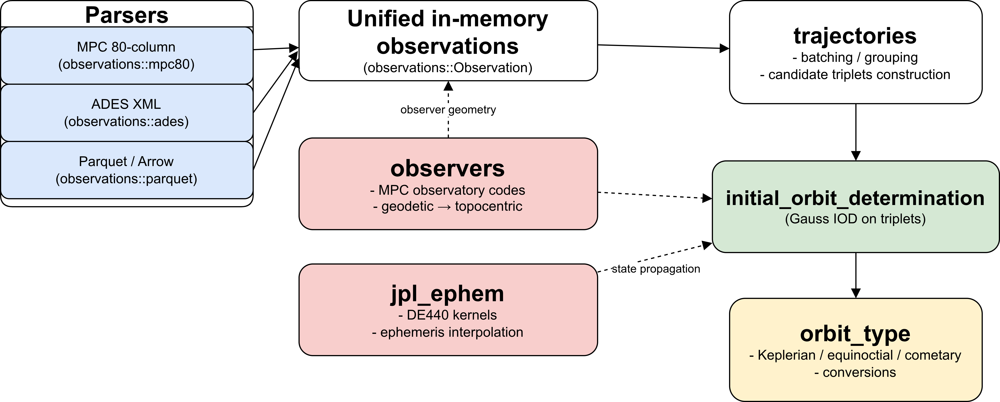

# Summary

Upcoming wide-field surveys—most notably the Vera C. Rubin Observatory’s Legacy Survey of Space and Time (LSST)—are expected to increase the number of known small Solar System bodies by an order of magnitude. This scale demands efficient, robust algorithms that can derive preliminary orbits quickly and reproducibly from large, heterogeneous datasets. 

**Outfit** is a Rust library for reading astrometric observations and computing preliminary orbits of small bodies using an implementation of the Gauss method. It provides high-throughput ingestion of common formats (Minor Planet Center 80-column, ADES XML, and Parquet), explicit observer management (MPC codes, topocentric geometry), and accurate state propagation via JPL planetary ephemerides (e.g., DE440). The library emphasizes speed, memory safety, reproducibility, and modular design: observation parsing and trajectory batching are decoupled from initial orbit determination (IOD) logic, and all public APIs are documented and tested. Outfit re-implements classic OrbFit IOD behavior in a modern, production-grade codebase, suitable for survey-scale pipelines (e.g., LSST/ZTF-like workloads).

# Statement of need

Astrometric pipelines for near-Earth and small-body surveys must ingest heterogeneous observation formats, manage observers, and determine preliminary orbits efficiently and reproducibly. Existing tools (e.g., OrbFit [@OrbFit]) are widely used and trusted, but often expose monolithic interfaces and legacy implementations that are harder to embed in data-intensive workflows. Outfit fills this gap by offering:

- A memory-safe, high-performance core implemented in Rust.
- Unified I/O across MPC 80-column [@MPC80col] and ADES XML [@ADES] with a columnar option (Parquet/Arrow [@Arrow; @Parquet]) for large batches.
- Explicit observer handling with MPC codes and topocentric geometry.
- Deterministic Gauss IOD with controlled numerical behavior and explicit error types.
- Clean integration with JPL ephemerides (DE series) [@DE440; @NAIF] for accurate state propagation
- Accurate time-scale handling via `hifitime` [@hifitime].
- Optional parallel computation for Gauss IOD (`--features parallel`) to scale across large batches.

This combination enables reproducible, scalable preliminary orbit determination and downstream evaluation (RMS of normalized residuals) within modern data processing stacks. Outfit is intended for researchers building survey pipelines, teaching orbit determination, or benchmarking algorithmic variants on large datasets.

# Software description

## Functionality

Outfit provides:

- Observation parsers: MPC 80-column, ADES XML, and Parquet.
- Trajectory batching utilities and adaptive batch APIs for large sets.
- Gauss IOD on triplets with acceptability filters and Lagrange coefficient refinement.
- Observer management (MPC codes, geodetic/geocentric geometry) and pretty-printing utilities.
- Ephemeris integration via JPL (DE440 and similar) with optional automatic download.
- Display helpers for compact/wide/ISO tables of observations.

## Architecture

The crate is organized into focused modules with clear responsibilities:

{ width=80% }

- observations — parsing MPC/ADES/Parquet, data validation, time-scale normalization.

- observers — MPC observatory codes, geodetic conversion, topocentric geometry.

- initial_orbit_determination — Gauss method, Lagrange coefficient iteration, acceptability filters, error reporting.

- trajectories — batching, grouping, and utilities for large candidate sets.

- jpl_ephem — DE ephemeris access (local kernels or automatic download).

- orbit_type — Keplerian, equinoctial, and cometary elements with conversions.

The public API favors explicit types, immutable inputs where possible, and strongly typed time and angle units. Performance-critical routines rely on nalgebra, while parallelism is opt-in via a crate feature. Columnar ingestion uses Arrow/Parquet to support HPC and distributed workflows.

## Quality, documentation, and testing

Outfit includes unit tests and integration tests covering parsing (MPC/ADES/Parquet), observer handling, Gauss IOD numerical behavior, and trajectory batching (see `tests/`). In addition, we use property‑based testing (via `proptest`) to stress numerical invariants and edge cases over wide parameter ranges, improving robustness beyond hand‑crafted cases. For accuracy, we run regression tests on real observation datasets and compare against OrbFit outputs [@OrbFit]: notably the objects 2015AB, 8467, and 33803 are validated with MPC 80‑column inputs (see `tests/data/` and `orbfit_tests/`).

Software quality is enforced through continuous integration (CI): we run automatic tests on each change, track code coverage, and perform semantic‑versioning checks (e.g., `semver` compatibility) to ensure API stability across releases. Version history is maintained via git with a clear changelog and tagged releases; this structured release process is not available in OrbFit’s upstream distribution. Examples in `examples/` demonstrate end‑to‑end workflows (e.g., reading Parquet and running Gauss IOD). The repository follows semantic versioning and maintains a comprehensive changelog [@SemVer; @KeepAChangelog]. The crate documentation is published on docs.rs and the README provides installation, quick‑start, feature flags (including `parallel`), and performance notes. Outfit is available on crates.io for easy installation and inclusion in other Rust projects via Cargo’s dependency system.

## Performance and reproducibility

 Rust enables predictable performance and memory safety. For survey-scale workloads, Outfit offers Parquet ingestion and optional parallel Gauss IOD (`--features parallel`) with a configurable batch size set via `IODParams.batch_size`. Numeric stability is enforced via explicit acceptability checks and non-finite score detection. Determinism is promoted through clear random seeding paths and ordered iteration for reporting.

## Python bindings (pyOutfit)

Outfit is also exposed to Python via pyOutfit, a binding built with PyO3 and distributed with maturin: https://github.com/FusRoman/pyOutfit. It provides a thin, idiomatic Python interface to the Rust core (parsing MPC/ADES/Parquet, observer handling, and Gauss IOD), enabling integration in notebooks and Python pipelines. The binding is available on PyPI and ships precompiled Rust manylinux wheels for Python 3.10, 3.11, and 3.12.

Project documentation is published on GitHub Pages using MkDocs Material, and the public API is type‑annotated via .pyi stub files to improve IDE completion and static type checking. Examples mirror the Rust examples to ease cross‑language adoption. The package includes a test suite, and the documentation examples are sourced from Python files and executed automatically in continuous integration to keep the documentation accurate and up to date.

# Demonstration

The crate ships runnable examples demonstrating observation ingestion and Gauss IOD. For instance, running the Parquet example with automatic ephemeris download:

```bash
cargo run --release --example parquet_to_orbit --features "jpl-download"
```

Illustrative outputs include orbital elements and RMS of normalized residuals, and optional progress reporting (`--features progress`). Examples are documented in the README and serve as minimal, reproducible entry points for reviewers to validate functionality locally as per JOSS guidelines.

# Limitation and futur work

Current limitations:
- Initial orbit determination is limited to the Gauss method on optical astrometry; no radar/radio observables are supported yet.
- No full least-squares refinement (differential corrections), hence no formal covariance or robust uncertainty quantification.
- Hyperbolic trajectories are not yet supported in fitting, limiting interstellar object handling.
- Efficient ephemerides generation from estimated orbits (initial or refined) is not yet exposed as a high-level API.

Planned work:
- Add full orbital estimation via a least-squares method (as in OrbFit), including covariance output and convergence diagnostics.
- Add an alternative initial orbit method (Vaisala/Väisälä) to complement Gauss.
- Add support for hyperbolic orbits to fit interstellar candidates (e.g., 1I/‘Oumuamua, 2I/Borisov, 3I/ATLAS).
- Add efficient ephemerides computation from estimated orbits (initial or full) for prediction and residual analysis.
- Add support for radio/radar observations (e.g., delay and Doppler), alongside optical astrometry.

# Acknowledgements

We acknowledge the maintainers of OrbFit for foundational work in preliminary orbit determination, the JPL Horizons/NAIF teams for ephemerides and kernels, and contributors and users who provided feedback on API ergonomics and tests. Development benefited from the Rust ecosystem and libraries cited below.

# References

